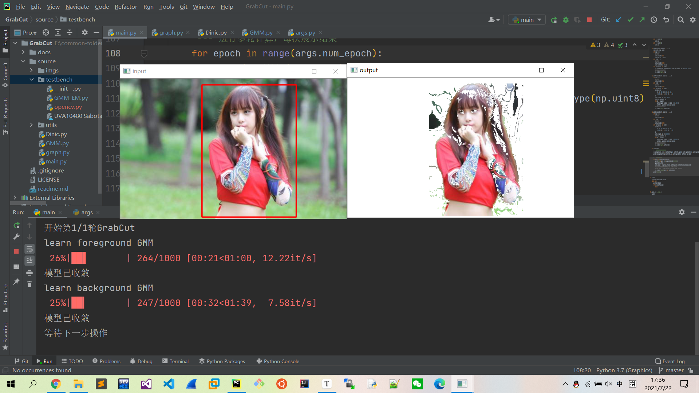

## Abstract

- Using "GrabCut" technique.

## Keyword

- Gaussian Mixture Model
- Maximum Likelihood Estimation
- Expectation Maximization Algorithm
- Network Flow Algorithm
- GrabCut
- GraphCut

## Principle

- 步骤：
  1. 将矩形内、外数据分别初始化为前景、后景点集。
  2. 将点集数据送给两个GMM并让它们学习到收敛。
  3. 对前景集合中的数据分别计算它们属于内GMM和外GMM的概率，并按照论文中公式赋值t-link和n-link。
  4. 使用求最大流的方法，找出最小割，并获得新的前景后景点集。
  5. 重复step 2-4.
- 注意：
  1. 为图片的前景类和后景类分别建立一个GMM，分别承担对应的二分类任务。
  2. 两类边权：区域项和边界项，区域项代表该像素属于前景分布或后景分布的概率，边界项代表该像素与周围像素的相似性。
  3. 使用网络流算法进行最大流最小割的计算。
  4. 论文中的$\gamma$设置为50，但在本代码实现中应设置为5.

## Usage

1. 在图片上画出红色框，包裹住前景。
2. 可选：
   - 按下`f`键，然后涂抹出蓝色区域，代表标注前景。
   - 按下`b`键，然后涂抹出绿色区域，代表标注后景。

## Mathematics

1. Gaussian Mixture Model（高斯混合模型）

   1. [WIKI](https://en.wikipedia.org/wiki/Mixture_model)

   2. 概念：是单一高斯概率密度函数的延伸，使用多个高斯概率密度函数（即正态分布曲线）精确地量化变量的总体分布，可以将变量的总体分布分解为若干个高斯分布。它可以作为一种聚类算法使用，事实上典型的聚类方法K-means就是GMM的一种特殊形式。

   3. 结构：每个高斯混合模型由K个模型分量组成，每个分量都是一个高斯分布模型，可以是多维的。

   4. 使用：对于每个输入的样本点x，每个分量模型可以通过自己的概率密度函数（Probability Density Function，简称PDF)，分别给出该点属于自己的概率，然后通过一个分割阈值来确定它是否属于自己。显然，对于只有一个分量的模型（退化成高斯模型），可以承担二分类任务；而对于含有多个分类的模型，则可以承担多分类任务（也可以作为二分类，使用多个分量模型的权和即可）。

   5. 公式：

      1. 分量模型（多维高斯分布）：$N(x| \mu, \Sigma) = \frac{1}{(2\pi)^{\frac{d}{2}}|\Sigma|^{\frac{1}{2}}} exp[-\frac{1}{2}(x - \mu)^{T} \Sigma^{-1} (x - \mu)]$.

         - $x$：$d$维，样本点向量，注意与一维的高斯分布（每个样本点是一个标量）不同。

         - $\mu$：$d$维，样本的均值向量。

         - $\Sigma$：$d*d$维，样本的协方差矩阵（[WIKI](https://zh.wikipedia.org/wiki/%E5%8D%8F%E6%96%B9%E5%B7%AE%E7%9F%A9%E9%98%B5)），$\Sigma_{i, j}$代表第$i$维随机变量和第$j$维随机变量的协方差。$|\Sigma|$为其行列式。

         - 推导过程

           1. 首先考虑$1$维标准高斯分布，即随机变量$x \backsim N(0, 1)$，其PDF为$f(x) = \frac{1}{\sqrt[]{2\pi}} exp(-\frac{x^2}{2})$.

           2. 对于$n$维独立的标准高斯分布，即$n$个独立随机变量的联合分布，有

              $p(x_1, x_2, ..., x_n) = p(x_1) p(x_2) ... p(x_n) = (2\pi)^{-\frac{n}{2}} exp(-\frac{x_1^2 + x_2^2 + ... + x_n^2}{2})$.

           3. 若令$X$为$n$维的列向量，则上式可表示为$f(x) = (2\pi)^{-\frac{n}{2}} exp(-\frac12x^Tx)$.

           4. 推广到一般形式，即设$y$由$x$进行线性变换得到，如$y = Ax + b$。由于原随机变量满足$x \backsim N(0, 1)$，所以$\mu = b$，即$y = Ax + b = Ax + \mu$.

           5. 显然，可以有逆变换$x = A^{-1} (y - \mu)$，亦有$dx = |A^{-1}| dy$.

           6. 定义协方差矩阵$\Sigma$，令$\Sigma^{-1} = (A^{-1})^T A^{-1}$，则有$|A| = |\Sigma|^\frac12$.

           7. 最后，由联合概率分布密度的定义，有
              $$
              \begin{align}
              1 
              & = \int ... \int f(x)dx \\ 
              & = \int ... \int f(A^{-1}(y - \mu))|A^{-1}|dy \\ 
              & = \int ... \int \frac{1}{(2\pi)^{\frac n2}|A|} exp[-\frac12(y - \mu)^T (A^{-1})^TA^{-1}(y - \mu)]dy \\
              & = \int ... \int \frac{1}{(2\pi)^{\frac n2}|\Sigma|^\frac12} exp[-\frac12(y - \mu)^T (A^{-1})^T\Sigma^{-1}(y - \mu)]dy
              \end{align}
              $$

           8. 故，多维向量$y$的联合概率密度函数为$f(y) = \frac{1}{(2\pi)^{\frac n2}|\Sigma|^\frac12} exp[-\frac12(y - \mu)^T (A^{-1})^T\Sigma^{-1}(y - \mu)]$，将向量$y$代换为向量$x$即可得到结果。

         - 几何意义：

           - 在二维空间中，一个$2$维高斯分布（分量模型）所表示的流形应当近似为一个椭圆；而三维空间中，一个$3$维高斯分布应对应一个椭球。而对于那些不成该类形状的分布，则应使用多个分量模型（高斯混合模型）共同表征。

      2. 高斯混合模型：$p(x) = \overset{K}{\underset{k=1}{\Sigma}}p(k)p(x | k) = \overset{K}{\underset{k=1}{\Sigma}}\pi_k N(x | \mu_k, \Sigma_k)$.

         - $p(k)$：选择该分量模型的概率（先验概率），满足$\overset{K}{\underset{k=1}{\Sigma}} p(k) = 1$.

2. Expectation Maximization（迭代求解算法）

   1. Maximum Likelihood Estimation（极大似然估计）
      - 概念：设有样本$Y = y_1, y_2, ..., y_N$，并假设抽样是独立的。则从该分布中恰好抽样到该样本的概率为$L(Y; \mu, \Sigma) = \Pi^N_{i=1} p(y_i; \mu, \Sigma)$。对上式求导并令导数为零时，所求出的参数$\mu, \Sigma$就是使此概率最大的参数。所以，极大似然估计的意义就是，通过最大化样本集的联合概率，来对参数进行估计，从而选择最佳的分布模型（参数）。
      
   2. EM算法（注意，如果只关心求解方法，只看`迭代过程`部分即可）

      - 到这里，我们应当已经知道GMM的求解过程就是求出其参数$\pi_k, \mu, \Sigma$，使得该组参数下的GMM最有可能产生我们的样本。

      - 那么，使用MLE能否求解GMM呢？接下来我们证明MLE无法求解GMM。

        1. 引入隐变量$\gamma$，它是一个K维的指示函数（二值），显然$p(\gamma_k = 1) = \pi_k$.
        2. 样本点概率为$p(y) = \Sigma_\gamma p(\gamma)p(y | \gamma) = \Sigma^K_{k=1}\pi_kN(y | \mu_k, \Sigma_k)$.
        3. 则样本的联合概率为$L(y | \mu, \Sigma, \pi) = \Pi^N_{i=1}p(y_i | \mu, \Sigma, \pi) = \Pi^N_{i=1} \Sigma^K_{j=1} \pi_j N(y_i | \mu_j, \Sigma_j)$.
        4. 取对数，有$\log \; L(y | \mu, \Sigma, \pi) = \Sigma^N_{i=1} \log \; \Sigma^K_{j=1} \pi_j N(y_i | \mu_j, \Sigma_j)$.
        5. 若想用MLE求解，则需要求上式的导数，而上式形式为对数中含有求和，所以无法求导。

      - 这就要求我们寻找一个迭代式的解法来求解这个优化问题。

      - 证明

        1. 首先，不加证明地给出EM算法的参数迭代公式
           $$
           \theta^{(t+1)} = \underset{\theta}{argmax}(\int_z p(z | x, \theta^{(t)}) \log \; p(x, z | \theta))dz
           $$

        2. 然后，证明该公式的有效性，也即每次迭代都有$p(x|\theta^{(t+1)}) > p(x|\theta^{(t)})$

           1. 首先引入（分量）模型选择隐变量$z$
              $$
              p(x, z | \theta) = \frac{p(x, z, \theta)}{p(\theta)} = \frac{p(x, \theta)}{p(\theta)} \cdot \frac{p(x, z, \theta)}{p(x, \theta)} = p(x | \theta) \cdot p(z | x, \theta)
              $$

           2. 等式两侧取对数
              $$
              \log \; p(x, z | \theta) = \log \; p(x | \theta) + \log \; p(z | x, \theta)
              $$

           3. 如此可以将隐变量$z$引入到了似然函数中
              $$
              \log \; p(x|\theta) = \log \; p(x, z|\theta) - \log \; p(z | x, \theta)
              $$

           4. 对等式两侧同时求关于$p(z|x, \theta^{(t)})$的期望（连续积分，离散权和）
              $$
              \int_z p(z|x, \theta^{(t)})\log \; p(x|\theta)dz = \int_z p(z|x, \theta^{(t)})\log \; p(x, z|\theta)dz - \int_z p(z|x, \theta^{(t)})\log \; p(z|x,\theta)dz
              $$

           5.  化简左式
              $$
              \int_z p(z|x, \theta^{(t)})\log \; p(x|\theta)dz = \log \; p(x|\theta)\int_z p(z|x, \theta^{(t)})dz = \log \; p(x|\theta)\cdot1 = \log \; p(x|\theta)
              $$

           6. 所以，我们有
              $$
              \log \; p(x|\theta) = \int_z p(z|x, \theta^{(t)})\log \; p(x, z|\theta)dz - \int_z p(z|x, \theta^{(t)})\log \; p(z|x,\theta)dz
              $$
           
        7. 而迭代式求解极大似然估计的思想就是使每一轮迭代之后，都满足
              $$
              \log \; p(x|\theta^{(t+1)} \geq \log \; p(x|\theta^{(t)})
              $$
           
        8. 故将该约束转化为
              $$
              \int_z p(z|x, \theta^{(t)})\log \; p(x, z|\theta^{(t+1)})dz - \int_z p(z|x, \theta^{(t)})\log \; p(z|x,\theta^{(t+1)})dz \\
              \geq \int_z p(z|x, \theta^{(t)})\log \; p(x, z|\theta^{(t)})dz - \int_z p(z|x, \theta^{(t)})\log \; p(z|x,\theta^{(t)})dz
              $$
           
        9. 将上式拆分，分别得到
              $$
              \int_z p(z|x, \theta^{(t)})\log \; p(x, z|\theta^{(t+1)})dz \geq \int_z p(z|x, \theta^{(t)})\log \; p(x, z|\theta^{(t)})dz \qquad (1) \\
              \int_z p(z|x, \theta^{(t)})\log \; p(z|x,\theta^{(t+1)})dz \leq \int_z p(z|x, \theta^{(t)})\log \; p(z|x,\theta^{(t)})dz \qquad (2)
              $$
           
        10. 观察式（1），发现其左右两侧恰好是EM算法的公式形式，而EM算法建立的前提就是$p(x|\theta^{(t+1)}) > p(x|\theta^{(t)})$，因此，式（1）得证。
           
        11. 观察式（2），对其进行等价变换
            $$
               \begin{align}
               &
               \int_z p(z|x, \theta^{(t)})\log \; p(z|x,\theta^{(t+1)})dz \leq \int_z p(z|x, \theta^{(t)})\log \; p(z|x,\theta^{(t)})dz \\
               & \implies 
               \int_z p(z|x, \theta^{(t)})\log \; p(z|x,\theta^{(t)})dz - 
               \int_z p(z|x, \theta^{(t)})\log \; p(z|x,\theta^{(t+1)})dz \geq 0 \\
               & \implies 
               \int_z p(z|x, \theta^{(t)})\log \; p(z|x,\theta^{(t)}) - p(z|x, \theta^{(t)})\log \; p(z|x,\theta^{(t+1)})dz \geq 0
               \\
               & \implies
               \int_z p(z|x, \theta^{(t)})\log \; \frac{p(z|x,\theta^{(t)})}{p(z|x, \theta^{(t+1)})}dz \geq 0
               \end{align}
            $$
           
        12. 观察上式，发现它是KL散度（[WIKI](https://zh.wikipedia.org/wiki/%E7%9B%B8%E5%AF%B9%E7%86%B5)）的形式，而KL散度的基本性质就是非负性，故上式成立，故式（2）得证。
           
        13. 综上所述，该公式的有效性证明完毕。
        
      - 数学分析

        1. 首先，引入隐变量$\gamma_{i=(1...N),j=(1...K)}$，代表第$i$个样本点属于第$j$个分量模型的概率。如此我们可以将不完全数据$Y=(y_1, y_2, ..., y_N)$（仅含各个样本点，不含各样本点属于哪个分量模型）补成完全数据$Y = ((y_1, \gamma_1), (y_2, \gamma_2), ..., (y_N, \gamma_N))$.

        2. 可以写出完全数据的似然函数
           $$
           \begin{align}
           p(y, \gamma | \mu, \Sigma, \pi)
           & = \Pi_{i=1}^N p(y_i, \gamma_i | \mu, \Sigma, \pi) \\
           & = \Pi_{i=1}^N \Pi_{j=1}^K (\pi_j N(y_i | \mu_j, \Sigma_j))^{\gamma_{i, j}} \\
           & = \Pi_{j=1}^K \Pi_{i=1}^N (\pi_j N(y_i | \mu_j, \Sigma_j))^{\gamma_{i, j}} \\
           & = \Pi_{j=1}^K \pi_j^{\Sigma^N_{i=1}\gamma_{i, j}} \cdot \Pi^K_{j=1} \Pi_{i=1}^N (N(y_i | \mu_j, \Sigma_j))^{\gamma_{i, j}}
           \end{align}
           $$

        3. 对数似然函数（注意，这里每个样本i对应的是j都是已知的）
           $$
           \log \; p(y, \gamma | \mu, \Sigma, \pi) = \Sigma^K_{j=1} (\Sigma^N_{i=1}\gamma_{i, j} \log\;\pi_j) + \Sigma^K_{j=1}\Sigma^N_{i=1} \gamma_{i, j}N(y_i | \mu_j, \Sigma_j)
           $$

        4. 假设我们可以使用一组初始参数，即$\mu^0, \Sigma^0, \pi^0$，则我们可以使用完全数据的似然函数对$E_j(\gamma_{i, j} | y_i, \mu^0, \Sigma^0, \pi^0)$求一个期望，这个期望称作$Q$函数。

        5. Q函数
           $$
           \begin{align}
           Q 
           & = \log \; p(y, \gamma | \mu, \Sigma, \pi) \cdot E_j(\gamma_{i, j} | y_i, \mu^0, \Sigma^0, \pi^0) \\
           & = \Sigma^K_{j=1} (\Sigma^N_{i=1} E_j(\gamma_{i, j} | y_i, \mu^0, \Sigma^0, \pi^0) \log\;\pi_j) + \Sigma^K_{j=1}\Sigma^N_{i=1} E_j(\gamma_{i, j} | y_i, \mu^0, \Sigma^0, \pi^0)N(y_i | \mu_j, \Sigma_j)
           \end{align}
           $$

        6. 其中，$E_j$就是对于某样本点$i$，它属于第$j$个分量模型的概率。
           $$
           \begin{align}
           E_j(\gamma_{i, j} | y_i, \mu^0, \Sigma^0, \pi^0) 
           & = p(\gamma_{i, j} = 1 | y_i, \mu^0, \Sigma^0, \pi^0) \\
           & = \frac{\pi^0_j N(y_i | \mu_j^0, \Sigma_j^0)}{\Sigma^K_{j=0}\pi^0_j N(y_i | \mu_j^0, \Sigma_j^0)}
           \end{align}
           $$

        7. EM迭代求解的过程，就是最大化Q函数的过程。

      - 迭代过程：首先初始化一组参数$\mu, \Sigma, w, \pi$，然后循环进行$E$步和$M$步，直至收敛。

        1. E步：expectation，期望步。
           - 根据上一轮的各分量模型的高斯分布参数$\mu, \Sigma$，求出模型选择参数$\pi$.
           
           - 步骤
           
             1. 首先，使用$\pi, \mu, \Sigma$计算每个变量分别属于每个簇的概率$w$.
                $$
                w_{i, j} = \frac{\pi_j P(x_i | \mu_j, \Sigma_j)}{\Sigma_{k=1}^K\pi_k P(x_i | \mu_k, \Sigma_k)}
                $$
           
             2. 然后，使用$w$计算分量模型的选择概率$\pi$.
                $$
                \pi_j = \frac{\Sigma_{i=1}^{N}w_{i, j}}{\Sigma_{i=1}^N \Sigma_{j=1}^Kw_{i, j}}
                $$
        2. M步：maximization，最大化步。
           - 根据E步求出的模型选择参数$\pi$，求出新一轮的各分量模型的高斯分布参数$\mu, \Sigma$.
           
           - 步骤
           
             1. 首先，使用$w$计算各分量模型的均值$\mu$.
                $$
                \mu_j = \frac{\Sigma_{i=1}^N w_{i, j} x_i}{\Sigma_{i=1}^{N}w_{i, j}}
                $$
           
             2. 然后，使用$w, \mu$计算各分量模型的协方差矩阵$\Sigma$.
                $$
                \Sigma_j = \frac{\Sigma_{i=1}^N w_{i, j}(x_i - \mu_j)^T(x_i - \mu_j) }{\Sigma_{i=1}^{N}w_{i, j}}
                $$

## Coding

- 文件目录结构

  - source
    - imgs
    - testbench
      - `GMM_EM.py`：使用二维数据测试GMM和EM算法的正确性。
      - `UVA10480 Sabotage.cpp`：使用带当前弧优化的Dinic算法求解无向边最大流最小割裸题，并输出边割集，测试网络流算法的正确性。
    - utils
      - `get_positive_definite.py`：获取正定矩阵。
      - `get_positive_semidefinite.py`：获取半正定矩阵。
    - `main.py`

- 开发过程

  1. 编程`GMM_EM.py`文件，对GMM模块进行测试。

     1. 设置数据的分布情况。我们使用二维数据，分为3簇高斯分布，并设置其均值、协方差矩阵、点数。

        ```python
        mu_hat = np.array(
            (
                [2.5, 8],
                [8, 2.5],
                [10, 10]
            )
        )   # [3, 2]
        sigma_hat = np.array(
            (
                [[2, 2], [2, 4]],
                [[4, 2], [2, 2]],
                [[2, 0], [0, 2]]
            )
        )   # [3, 2, 2]
        pts_hat = [300, 600, 900]
        k = 3
        ```

     2. 初始化模型，并生成数据集。

        ```python
        gmm = GMM(mu_hat, sigma_hat, pts_hat, k)
        class GMM():
            def __init__(self, mu, sigma, pts, k):
                '''这里传递的是真实值，而非迭代的初始值。（GMM的类属性都是真实值而非计算值）
                mu: [k, d]
                sigma: [k, d, d]
                pts: num of points in each sample set
                k: num of component models
                '''
                self.mu, self.sigma, self.pts = mu, sigma, pts
                self.k = k
                self.x0, self.x1, self.x2, self.x = self.get_x(mu, sigma, pts)
        
        
            def get_x(self, mu, sigma, pts):
                x0 = np.random.multivariate_normal(mu[0], sigma[0], pts[0])
                x1 = np.random.multivariate_normal(mu[1], sigma[1], pts[1])
                x2 = np.random.multivariate_normal(mu[2], sigma[2], pts[2])
                # 生成三簇数据，每簇100个样本点
                x = np.vstack((x0, x1, x2))     # [300+600+900, 2]
                return x0, x1, x2, x
        ```

     3. 进行模型训练，设置我们期望的分量模型个数也为3，最大迭代轮数为100。每一轮迭代依次更新$w, \pi, \mu, \Sigma$（其各自的更新函数详见代码）。

        ```python
        gmm.learn(k=3, num_epoch=100)
            def learn(self, k, num_epoch):
                '''
                k: num of component models
                '''
                mu = np.random.randint(1, 5, (k, 2))
                sigma = np.random.randint(1, 5, (k, 2, 2))
                w = np.ones((sum(self.pts), k)) / k     # w[i][j]代表第i个样本点属于第j个分量模型的概率，初始为等概率
                pi = np.sum(w, axis=0) / np.sum(w)      # p[j]代表选择第j个分量模型的概率，初始为等概率
                llh_ls = []
                for epoch in range(num_epoch):
                    llh_ls.append(self.get_llh(k, pi, mu, sigma))
                    print(f'[{epoch}]: loglikelyhood: {llh_ls[-1]}')
                    if len(llh_ls) > 1 and llh_ls[-1] == llh_ls[-2]:
                        self.show(k, mu, sigma)
                        break
                    elif epoch % 10 == 0:
                        self.show(k, mu, sigma)
                    w = self.update_w(k, mu, sigma, pi)
                    pi = self.update_pi(k, w)
                    mu = self.update_mu(k, w)
                    sigma = self.update_sigma(k, w, mu)
        
        ```

     4. 在每一轮迭代时，都计算目前GMM能够获得的最大似然估计，并判断模型是否收敛。

        ```python
        def get_llh(self, k, pi, mu, sigma):
            pdfs = np.zeros((self.x.shape[0], k))
            for j in range(k):
                pdfs[:, j] = pi[j] * multivariate_normal.pdf(
                    self.x,
                    mu[j],
                    np.diag([sigma[j, _, _] for _ in range(sigma.shape[-1])])
                )
            return - np.mean(np.log(pdfs.sum(axis=1)))
        ```

     5. 每10轮迭代，展示拟合结果。

        ```python
        def show(self, k, mu, sigma):
            plt.figure(figsize=(10, 8))
            plt.axis((-5, 15, -5, 15))
            def true_plot():
                '--- 展示真实数据类'
                plt.scatter(self.x0[:, 0], self.x0[:, 1], s=5)
                plt.scatter(self.x1[:, 0], self.x1[:, 1], s=5)
                plt.scatter(self.x2[:, 0], self.x2[:, 1], s=5)
            def calc_plot():
                '--- 展示计算分类'
                colors = ['r', 'g', 'b']
                plt.scatter(self.x[:, 0], self.x[:, 1], s=5)
                ax = plt.gca()
                for cur in range(self.k):
                    # 绘制真实高斯分布流形
                    args = {
                        'facecolor': 'None',        # 默认有颜色填充，将其更改为无填充
                        'edgecolor': colors[cur],   # 默认为无色，将其更改为有颜色
                        'linewidth': 2,             # 线条粗细
                        'linestyle': ':'            # 默认为实线，设置为虚线
                    }
                    conv = self.sigma[cur]
                    _, v = np.linalg.eig(conv)  # 计算协方差矩阵的特征向量
                    angle = np.rad2deg(np.arccos(v[0, 0]))  # 计算应该偏转的角度
                    e = Ellipse(self.mu[cur], 3 * self.sigma[cur][0][0], 3 * self.sigma[cur][1][1], angle, **args)
                    # 椭圆中心坐标，宽度，高度，绘画参数
                    ax.add_patch(e)
                for cur in range(k):
                    # 绘制计算高斯分布流形
                    args = {
                        'facecolor': 'None',        # 默认有颜色填充，将其更改为无填充
                        'edgecolor': 'r',           # 默认为无色，将其更改为有颜色
                        'linewidth': 2,             # 线条粗细
                    }
                    conv = sigma[cur]
                    _, v = np.linalg.eig(conv)  # 计算协方差矩阵的特征向量
                    angle = np.rad2deg(np.arccos(v[0, 0]))  # 计算应该偏转的角度
                    e = Ellipse(mu[cur], 3 * sigma[cur][0][0], 3 * sigma[cur][1][1], angle, **args)
                    ax.add_patch(e)     # 绘制高斯分布（椭圆）
            calc_plot()
            plt.show()
        ```

     6. 展示结果（虚线是真实分布，实线是模型计算分布）

        1. 0轮（随机初始值）

           

        2. 10轮

           

        3. 20轮

           

        4. 30轮

           

        5. 40轮

           

        6. 查看日志，证明模型已经收敛。

           ```python
           [0]: loglikelyhood: 12.267037215186347
           [1]: loglikelyhood: 5.231127288615907
           [2]: loglikelyhood: 5.191702249004407
           [3]: loglikelyhood: 5.141392745986533
           [4]: loglikelyhood: 5.083904510923752
           [5]: loglikelyhood: 5.031166486827252
           [6]: loglikelyhood: 4.978405160769869
           [7]: loglikelyhood: 4.915171032957457
           [8]: loglikelyhood: 4.851509395119193
           [9]: loglikelyhood: 4.813266290280343
           [10]: loglikelyhood: 4.794315382867159
           [11]: loglikelyhood: 4.7810217720338715
           [12]: loglikelyhood: 4.768199038813596
           [13]: loglikelyhood: 4.754418071035711
           [14]: loglikelyhood: 4.7400823307206235
           [15]: loglikelyhood: 4.727472238166478
           [16]: loglikelyhood: 4.719337214227895
           [17]: loglikelyhood: 4.715690069335588
           [18]: loglikelyhood: 4.714507401831344
           [19]: loglikelyhood: 4.714208638336598
           [20]: loglikelyhood: 4.714143418564018
           [21]: loglikelyhood: 4.714130021165521
           [22]: loglikelyhood: 4.714127304229113
           [23]: loglikelyhood: 4.714126746883143
           [24]: loglikelyhood: 4.714126629655769
           [25]: loglikelyhood: 4.714126604148654
           [26]: loglikelyhood: 4.714126598370389
           [27]: loglikelyhood: 4.714126597002241
           [28]: loglikelyhood: 4.714126596663384
           [29]: loglikelyhood: 4.714126596575815
           [30]: loglikelyhood: 4.714126596552325
           [31]: loglikelyhood: 4.71412659654583
           [32]: loglikelyhood: 4.7141265965439905
           [33]: loglikelyhood: 4.714126596543459
           [34]: loglikelyhood: 4.714126596543306
           [35]: loglikelyhood: 4.714126596543257
           [36]: loglikelyhood: 4.714126596543245
           [37]: loglikelyhood: 4.714126596543243
           [38]: loglikelyhood: 4.714126596543241
           [39]: loglikelyhood: 4.714126596543238
           [40]: loglikelyhood: 4.714126596543238
           ```

        7. 探索如果将分量模型个数设置为4，效果为：模型仍然能收敛，但是其中一个分量模型基本无贡献。

           
     
  2. 编程`UVA10480 Sabotage.cpp`，对Dinic模块进行测试。
  
     1. 由于Grabcut是一个稀疏图，所以使用链表式建图。
  
        ```cpp
        struct Edge{
        	int v, w, nxt;
        }edge[maxn * 10];
        // edge[i]以边为下标 
        
        int n, m;
        int head[maxn], cnt;
        // head[i]以点为下标，存放最后一条以该点为起点的边 
        // cnt是所有边，包括正向边和反向边 
        int deep[maxn];	// deep[i]以点为下标，0代表该点不能到达点t 
        int now[maxn];  // now[i]以点为下标，代表该点的当前弧
        int vis[maxn];	// 只在dfs染色时使用，以点为下标，代表该点是否属于起点集合 
        
        void init(){
        	memset(vis, false, sizeof(vis));
        	memset(head, -1, sizeof(head));
        	cnt = 0;
        	return;
        }
        void addedge(int a, int b, int w){
        	// 正向边 
        	edge[cnt].v = b;
        	edge[cnt].w = w;
        	edge[cnt].nxt = head[a];	// 上一条以a为起点的边 
        	head[a] = cnt;	// 存储最后一条以a为起点的边 
        	cnt++;
        	//反向边 
        	edge[cnt].v = a;
        	edge[cnt].w = w;	// 因为是无向边，所以反向边容量也为w 
        	edge[cnt].nxt = head[b];
        	head[b] = cnt;
        	cnt++;
        	return;
        }
        
        ```
  
     2. 使用Dinic算法求解最大流，并且使用当前弧优化。每一次bfs进行多次增广。
  
        ```cpp
        int solve(int s, int t){
        	int ans = 0;
        	while(bfs(s, t)){
        		int flow;
        		while(flow = dinic(s, t, INF)){
        			ans += flow;
        		}
        	}
        	return ans;
        }
        
        bool bfs(int s, int t){
           memset(deep, 0, sizeof(deep)); // 首先认为所有点都到不了t 
           queue<int> q;
           q.push(s);
           now[s] = head[s];  // s的当前弧应当是最后一条以s为起点的边 
           deep[s] = 1;
           while(q.size()){
              int u = q.front();
              q.pop();
              for(int i=head[u]; i!=-1; i=edge[i].nxt){
                 int w = edge[i].w, v = edge[i].v;
                 if(deep[v] || !w)
                    continue;
                 deep[v] = deep[u] + 1;
                 now[v] = head[v];  // v的当前弧应当是最后一条以v为起点的边
                 q.push(v);
                 if(v == t)
                    return true;   // 只要能找到增广路就可以了 
              }
           }
           return false;
        }
        
        int dinic(int s, int t, int flow){
        	if(s == t)
        		return flow;
        	int i, rest=flow;
        	for(i=now[s]; i!=-1 && rest; i=edge[i].nxt){
        		int w = edge[i].w, v = edge[i].v;
        		if(w && deep[v] == deep[s] + 1){
        			int deep_rest = dinic(v, t, min(rest, w));
        			if(!deep_rest)
        				deep[v] = 0;	// 从v无法到t 
        			edge[i].w -= deep_rest;
        			edge[i^1].w += deep_rest;
        			rest -= deep_rest;
        		}
        	}
        	now[s] = i;	// 当前弧需要跳过已经被榨干的弧 
        	return flow - rest;	// 返回还剩余多少流量没有分配 
        } 
        
        ```
  
     3. 因为需要输出边割集，所以从起点开始对其所在集合进行染色。
  
        ```cpp
        void dfs(int s){
           vis[s] = true;
           for(int i=head[s]; i!=-1; i=edge[i].nxt){
              int v = edge[i].v;
              if(vis[v])
                 continue;
              if(edge[i].w)
                 dfs(v);    // 如果已经为0，说明是瓶颈边，应当被切断 
           }
           return;
        } 
        ```
  
     4. 遍历所有边，两端点颜色不同的边即属于边割集。
  
        ```cpp
        for(int i=0; i<cnt; i+=2){
           int u = edge[i^1].v, v = edge[i].v;
           if(vis[u] != vis[v])
              cout<<u<<' '<<v<<endl;
        }
        ```
     
  3. 编程框图部分，程序打开输入图片，用户需要在图片上绘制出红色矩形框，可以多次绘制，确定粗略的前景后景。
  
  4. 将GMM模块加入程序，并测试其运行结果。
  
     
  
  5. 将网络流部分加入程序，并测试其只迭代一轮的运行结果。可以看到，比单纯使用GMM要好得多，但是仍不完美，尤其是前景、后景的交界处。
  
     
  
  6. 编程人工标定前景后景部分：用户按下`f`键，然后使用鼠标涂抹出蓝色的区域，视为前景；用户按下`b`键，然后使用鼠标涂抹出绿色的区域，视为后景。
  
  7. 测试多轮迭代结果，可以看到，经过5轮迭代之后，错误的前景区域逐渐减少直至消失（advantage），但是错误的后景区域会逐渐扩大（weakness）。同时正确的后景区域也在逐渐扩大，使前景边缘更贴合。
  
     
  
  8. 测试添加标注的效果，可以看到，错误的前景从一开始就很少，并且错误的后景也大量减少了。
  
     

## Conclusion

- python递归不能过深，默认最大深度为1000。解决办法有：

  1. 增大递归深度

     ```python
     import sys
     sys.setrecursionlimit(maxValidTimes)
     ```

  2. 将dfs改成bfs

- 注意像素是无符号数，要破除其限制，可以：

  ```python
  x = x.astype(int)
  ```

  但是这样会导致在使用`imshow`函数时无法正常显示图片（imwrite不受影响），可以：

  ```python
  x = x.astype(np.uint8)
  ```

- 如果继续做的话，可能会去写一下`GraphCut`，看看能否达到较好的效果。

## References

- [GrabCut：Interactive Foreground Extraction using Iterated Graph Cuts](https://www.researchgate.net/publication/220184077_GrabCut_Interactive_Foreground_Extraction_Using_Iterated_Graph_Cuts)
- [GraphCut算法](http://shichaoxin.com/2018/10/21/%E5%9B%BE%E5%83%8F%E5%88%86%E5%89%B2-Graph-Cut%E7%AE%97%E6%B3%95/)
- [搞懂多维高斯分布的由来](https://zhuanlan.zhihu.com/p/39763207)
- [详解EM算法与混合高斯模型](https://blog.csdn.net/lin_limin/article/details/81048411)
- [EM算法的有效性证明](https://www.zhihu.com/question/22371861/answer/1693488642)
- [EM算法计算过程](https://zhuanlan.zhihu.com/p/78311644)
- [GMM与EM算法的Python实现](http://sofasofa.io/tutorials/gmm_em/)
- [Vjudge-UVA10480 Sabotage](https://vjudge.net/problem/UVA-10480)
- [Sabotage讲解](https://blog.csdn.net/qq_45458915/article/details/103455992)
- [实时显示矩形框](https://blog.csdn.net/qq_25105061/article/details/108783665)

